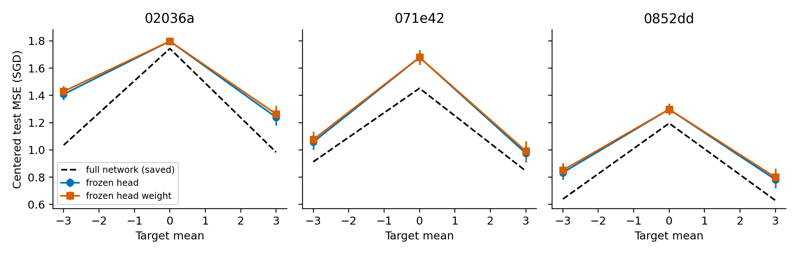

# 固定 head 后，标签偏移仍促进 hidden 的形状拟合

360 次新受控训练否定了“偏移收益必须依赖 head 权重增长”的预测。固定 head weight 仍保留全网络 SGD 中心化收益的 61.5%、112.6%、84.3%；完整冻结 head 时收益同样保留。三个函数中所有 30 个配对 seeds 的中心化 chord gap 均为负。此结果属于已见函数的开发实验，没有新的 OOD 或 solver 涨分证据。

## 现象与竞争解释

e16 在标签均值 ±3 下观察到 SGD 形状拟合改善；e17 冻结 hidden 后恢复固定特征 SGD 的仿射输出与凸 offset loss。尚未区分收益是否必须由 head 增长放大 hidden 梯度，还是已有固定 head 下的 hidden 更新已足够。A01 新增 frozen_head 与 frozen_head_weight；前者锁住 weight/bias，后者只锁 weight。完全可训练基线与 frozen_hidden 数据直接复用。

## 配置和预先预测

沿用三个 8D 函数、d3w192 GELU/LN010、MSE、T256/b64、coupled wd1e-4、SGD .001/m0 对 Adam3e-5、seeds0–9。原始初始化与新模型逐 tensor 及输出一致。preregistration.json 在 commit 7027db7 中、训练前冻结。预测固定 head weight 会将负中心化 chord 收益削弱至少 50%，以及固定 head 后 hidden 仍可将终点均值残差平方降到 0.5 以下。所有有限高 loss 保留。

## 结果与反例

中心化 chord=[E_centered(−3)+E_centered(+3)]/2−E_centered(0)。负数表示偏移下形状拟合改善。区间为固定函数/划分的 10 配对 seed t9 95% 区间。

|函数|全网络保存基线|固定 head weight|固定完整 head|
|---|---:|---:|---:|
|02036a|−.7339|−.4513 [−.4734,−.4292]|−.4739 [−.4955,−.4523]|
|071e42|−.5725|−.6447 [−.6720,−.6174]|−.6624 [−.6890,−.6358]|
|0852dd|−.5613|−.4730 [−.4967,−.4492]|−.4903 [−.5126,−.4680]|

三项 head-weight 衰减预测全部失败。六个“函数×非零偏移”的 hidden 拟合常数预测全部成功，终点均值残差平方为 .00155–.01601，低于 .5。固定 head 并未消除通过 hidden 改变均值与形状的能力。因此 head weight 可训练性不是这些收益的必要条件；这不等于否定固定 head 范数对梯度尺度的影响，也没有定位 LN 或 feature/Jacobian 漂移的具体中介。

## 复现、恢复和下一预测

执行 run.py 首次保存 7 次成功后正常 checkpoint 退出，续跑复用 7 次并新做 353 次；14 个先保存 JSON/NPZ 的 SHA 均不变。成功缓存以 cell/config/数据/执行源码 hash 核对，frozen 参数位移全部严格为零。运行总约 65.9 秒，无模型调用。analyze.py 从全部 360 测量重算、核对 NPZ 与 e16 基线 hash 并画图。

下一轮封存新的函数结构、输入分布、宽度与 LN 条件。在训练结果可见前，分别保存“固定 head 下 SGD offset 收益能外推”和“冻结 hidden 的仿射/凸性保持”的预测，记录失败的结构边界。matched_bias 对称是理论一致性检验，不能代替优化器赢家 OOD 预测。初始残差与有效学习时间尚没有充分公式；sol 应用需另做固定模型/预算的新知识对照。
