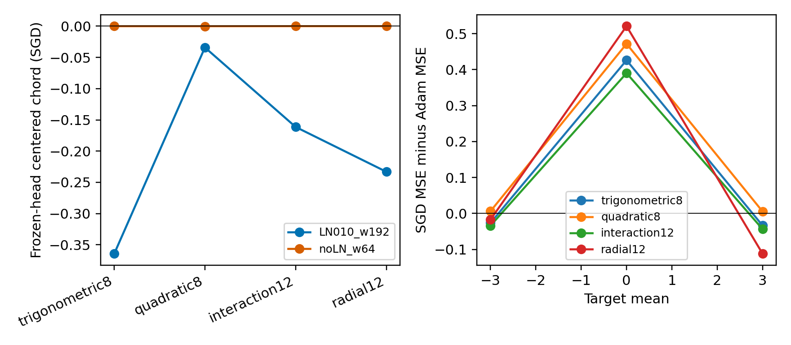

# 新函数验证：hidden 偏移收益可转移，优化器赢家仍有反例

封存后的4类新函数中，固定head的SGD偏移形状收益4/4保留；“mean0选Adam、±3选SGD”的更强赢家预测仅10/12通过，二次函数的两个非零偏移失败。可转移的是这些结构下的训练路径效应，不能据此建立一个只看均值的优化器选择阈值。

## 封存条件与真实测量

在commit 1e3cfa8冻结生成器、预测与执行器hash，seal.json记录结果目录不存在；最早结果的保存时间晚于seal。目标为新trigonometric8、quadratic8、interaction12、radial12；输入从旧U([0,1]^8)扩展到U([-1,1]^8)和Gaussian12。只用train均值/方差标准化，test用同一变换。4函数×2结构×3offset×4干预×2optimizer×5seeds=960次训练，约121.3秒。314个MSE>2的有限终点全数保留，无失败、无模型调用。

两组结构是LN010/w192与noLN/w64，均d3/GELU/plain。T256/b64、coupledwd1e-4、SGD.001/m0对Adam3e-5。LN和宽度同时变化，因而它们的边界差异是bundle证据，不能称LN单因果；下一轮需要2×2正交。

## 预先预测及失败

|命题|通过条件|证据边界|
|---|---:|---|
|LN010/w192固定head仍有负中心化chord|4/4函数|三角−.3642、二次−.0341、交互−.1613、径向−.2330|
|mean0 Adam、±3 SGD的winner方向|10/12函数×offset|二次函数±3仍偏Adam，差+.00631/+.00536；未把近零gap改判为通过|
|matched bias使offset MSE差≤.001|16/16函数/recipe/optimizer|最大差2.89e−5；属于平移对称一致性，独立于winner效用|
|冻结hidden的SGD输出仿射、offset loss凸|8/8函数/recipe|最大仿射第二差≤7.68e−7；不外推给Adam|
|noLN/w64偏移收益<LN010/w192的一半|4/4函数|noLN chord约−2.74e−5到+5.65e−5；LN/宽度混杂待拆|

区间和逐seed差保存在analysis.json。每个函数/recipe是研究单位，5seeds只提供条件内不确定性；新目标结构、输入分布、维度分别注明，不把40seeds包装成40独立任务。

## 可用原理与下一实验

plain MSE与可加output bias支持平移对称；weak coupleddecay轻微破坏它。固定特征SGD的有限步仿射性质也跨新函数/结构验证。非线性hidden学习的负offset chord在LN010/w192转移，但不足以保证跨optimizer胜出，目标形状参与效用。A01已否定“head增长必要”，A02把适用域从三个旧函数扩到新结构目标，同时留下二次目标反例。

下一轮先用同宽度LN开关及同LN宽度开关拆bundle，再检查初始gradient/feature尺度能否预测路径变化。A02结果一旦用于设计后续方法，A02成为development；新预测使用另一组封存函数。没有solver涨分读数。

复算：在repo根执行 python studies/A02_ood_residual/analyze.py。run.py可恢复、逐cell校验成功hash；重新调用会复用保存测量。执行源码、数据、preregistration、seal、全部JSON/NPZ保存在同目录。
