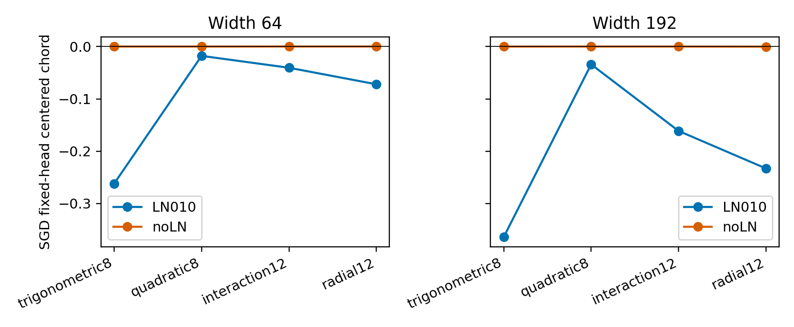

# 同宽度拆分后，LN 才是当前偏移收益的主要边界

新增240次训练补齐A02的2×2宽度/LN设计；4个已见新函数、两个宽度下，开启中间LN都让固定head的SGD中心化offset chord更负，8/8配对区间不跨零。w64有LN已保留收益，w192无LN仍几乎没有收益。当前recipe的LN条件作用不能用宽度不足解释。

## 如何拆混杂

A02只比较LN010/w192和noLN/w64。A03新增LN010/w64和noLN/w192，复用A02对应240次成功测量，不重训。统一d3/GELU/plain、SGD.001/m0、wd1e-4、T256/b64、5配对seeds和三个offset。同宽度LN开关的Linear参数初始化与stream可匹配；宽度间不声称初始化逐参数匹配。

|函数|w64的LN−noLN chord [95%区间]|w192的LN−noLN chord [95%区间]|
|---|---:|---:|
|三角|−.2619 [−.3082,−.2157]|−.3641 [−.4180,−.3103]|
|二次|−.0178 [−.0313,−.0043]|−.0340 [−.0568,−.0113]|
|交互|−.0406 [−.0579,−.0233]|−.1613 [−.1854,−.1372]|
|径向|−.0722 [−.1028,−.0416]|−.2328 [−.2647,−.2008]|

LN主要条件预测8/8、w64带LN负chord4/4、w192无LN不足半数收益4/4通过。研究单位是4个函数和结构条件，区间只测固定函数下的seed。此轮是在已揭露的A02函数上做development，不计作新最终OOD。

## 机制仍需区分

中间LN可能放大低激活尺度的梯度，也可能通过其affine参数、bias和hidden Linear参与不同非线性路径。删除LN改变函数，因而现有8/8不能把效应归给LN gain学习；下一实验在同一LN模型/同一初始化固定head后分别冻结LN affine、hidden biases或只训练LN affine，保留全部梯度和实际函数更新。

A01排除了head增长必要，A02验证新函数的收益但否定两项winner预测，A03定位LN条件而非宽度bundle。仍没有新条件下优化器winner的精确公式；判断要包含目标形状、初始化、结构和实测进度。

复算：python studies/A03_ln_width/analyze.py。全部新JSON/NPZ、复用来源hash、实际executor副本、预注册与图在本repo；新执行约29.1秒，无模型调用、无solver读数。
