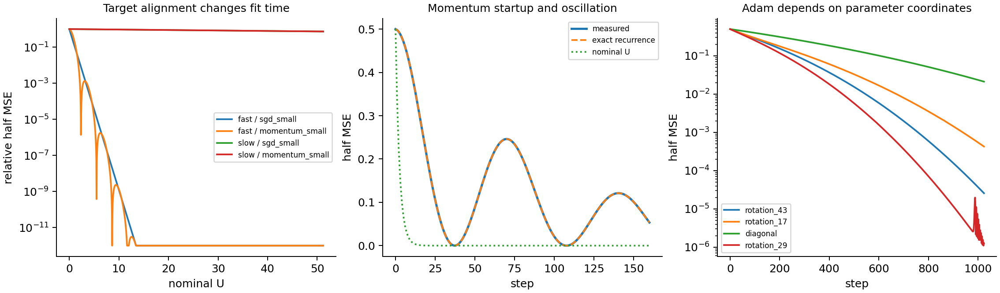

# 有效学习时间先要包含目标和谱

192 个固定特征校准训练中，SGD/动量 SGD 的完整谱递推精确预测轨迹；相同名义 U 并不保证相同拟合程度，Adam 还受参数坐标影响。这是已知二次优化关系的执行器核验和反例，尚不是非线性网络的新理论，也没有 solver 涨分测量。

## 现象与定义

采用半均方损失 L=||Xθ−y||²/(2n)、全批量、无 decay、float64。初始 θ=0，所有目标初始 L=.5；开发域 d=8、两组谱、快/慢目标，事先封存 d=16、新谱和三个旋转坐标的外推。6 recipes×4 条件×4 坐标，开发/外推各96 cells；每个谱/目标/recipe 为一个单位，旋转只测坐标敏感性。

“充分拟合”明确为此后全轨迹始终≤初始损失1%；未达到者右删失。名义 U=ηt/(1−μ)。它没有目标对齐信息。

## 理论与区分预测

H=XᵀX/n 的特征值为 λᵢ，函数残差模态为 eᵢ。普通 SGD 精确为 eᵢ(t)=(1−ηλᵢ)ᵗeᵢ(0)。PyTorch 动量 SGD 第一更新相同，随后 eᵢ(t+1)=(1+μ−ηλᵢ)eᵢ(t)−μeᵢ(t−1)。恒定梯度的启动修正 Uₜ=η[t/(1−μ)−μ(1−μᵗ)/(1−μ)²]，仍不能代替各模态的递推。

Adam 第一步是 Δθⱼ=−ηgⱼ/(|gⱼ|+ε)。正交旋转参数不会改变函数问题和 Hessian 谱，但会改变这一逐坐标归一化。因此预先预测 SGD 旋转不变、Adam 第一模态变化依赖坐标；没有预言 Adam 终点赢家。

## 结果与反例

|检验|d8 开发|d16 事前封存外推|
|---|---:|---:|
|SGD 完整谱递推最大绝对模态误差|2.10e−12|4.38e−12|
|SGD 坐标旋转最大轨迹损失差|1.19e−15|9.44e−16|
|Adam 第一更新公式最大误差|2.74e−15|1.57e−15|
|μ=.99 快目标，名义指数时间损失 RMSE|.06598|.06598|
|Adam 新谱慢目标，旋转/对角第一步目标进度|—|3.13–3.47倍|

d16 同一谱下普通 SGD η=.05 的快目标45步达到1%；慢目标1024步仍 L=.36774，未饱和。动量 μ=.9、η=.005 的名义 U 相同，快目标37步饱和；慢目标仍 L=.36859。μ=.99、η=.002 的快目标需要436步才持续低于1%，早期呈震荡，名义 U 夸大启动进度。

Adam 旋转后的终点差异也明显，但该幅度是事后观察：新谱慢目标，对角坐标1024步 L=.02120，三个旋转坐标更低；完整轨迹最大损失差=.24341。没有用此结果事后补写 endpoint 预测。

## 恢复与复现

运行开发域时先保存3个成功 cells退出，再续跑；这3份 metadata/arrays 的 hash 完全不变，续跑记录 resumed_successes=3。两个阶段合计训练约10.5秒，无失败 cells。NumPy BLAS 曾产生浮点警告；全部保存数组均有限，独立谱递推/第一更新及旋转核验通过，保留原始日志。

~~~sh
python studies/B01_effective_time/run.py --phase development
python studies/B01_effective_time/analyze.py --phase development
python studies/B01_effective_time/run.py --phase ood
python studies/B01_effective_time/analyze.py --phase ood
~~~

run.py 与 preregistration.json 已 pin。分析读取所有 NPZ 并核对 SHA；resume 不重跑成功 cells。证据见 development_analysis.json、ood_analysis.json、resume_verification.json。

## 下一问题与边界

这里能精确计算充分拟合时间，因为固定特征谱不变。非线性网络的 Jacobian 漂移、激活和优化器状态会改变谱与可拟合方向；B02 将用初始函数 Jacobian预测真实 MLP 轨迹，比较宽度和动量，再封存新函数/维度/容量条件。历史 |g|≈.01、.03 是特定题库的经验校准，不能由本实验升格成普适 Adam 等效常数。
