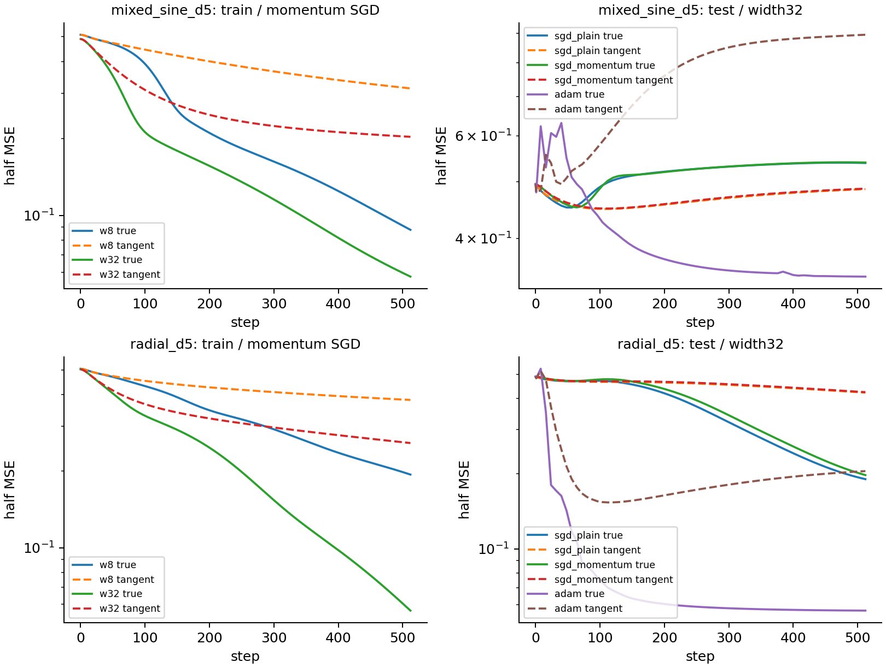

# 初始谱解释早期进度，解释不了后期拟合与泛化

固定初始 Jacobian 的切线模型精确复现 SGD 谱递推，却在真实 MLP 的后期明显落后。两种新函数、d=5 的8个预注册 SGD 条件全出现非线性训练增益；其中6个条件的 test loss反而比切线模型更高。拟合更充分不能单独解释架构赢家，也不能代替泛化证据。

## 受控比较

真实模型为两层 SiLU MLP，无 LN/residual、width8/32；每条件3个初始化 seeds。训练32个 Gaussian点，独立256点作为本函数 test；y按训练集均值/方差中心化标准化。全批量512步、半MSE、无decay、float64。SGDplain η=.05、SGDmomentum η=.005/μ=.9 与 Adam η=.01；开发 smooth_sum/product d3，封存 mixed_sine/radial d5。两阶段各36paired cells，合计72真实MLP＋72切线训练。

切线模型 f_lin(x)=f₀(x)+J₀(x)δθ，与真实模型共享同初始化、完整参数 Jacobian和optimizer。初始 K₀=J₀J₀ᵀ/n的完整谱给出切线 SGD 精确预测；这没有把非线性特征学习当作已知答案。width对比同时改变初始谱和容量，不能称单因素参数量干预。

## 预测与结果

|事前预测|开发|封存外推|
|---|---:|---:|
|切线SGD完整谱递推误差<1e−9|最大6.64e−13|最大4.17e−13|
|真实/切线SGD第一步误差≤.001初始loss|24/24|24/24|
|至少一个unit后期差>.05初始loss|9/12units|10/12units|
|OOD的8个SGDunits：真实train至少优于切线.05初始loss|开发后封存|8/8；增益.297–.462|

下表为三seed均值，数值都是半MSE；函数/宽度/recipe为单位，seeds不算独立目标。

|d5新函数，SGDplain|真实train|切线train|真实test|切线test|
|---|---:|---:|---:|---:|
|mixed_sine，width8|.07961|.31309|.56504|.44843|
|mixed_sine，width32|.05391|.20270|.53887|.48601|
|radial，width8|.18361|.38041|.50212|.48567|
|radial，width32|.04978|.25701|.19024|.42187|

momentum同方向；6/8 SGDunits的训练增益没有变成test优势。开发 product width32 的真实train约.03、切线约.31，而smooth_sum width8也有大差异，因此初始谱模型会误判“进度不足”和相对容量。

## 机制证据与仍未区分的解释

初始谱在第一步准确，后期不准确，排除了执行器递推误差。终点核谱/Jacobian相对漂移均已保存，但全核漂移范数与曲线误差的事后Spearman相关很弱（开发ρ=.186、外推ρ=.163）；这个范数尚不能预测哪些目标得到功能增益。

两种解释仍竞争：核变化只放大了学习速度；或学习改变了目标相关特征/谱方向。B03将以相同已训练输出、相同残差启动线性问题，比较晚期Jacobian与按trace缩放的初始Jacobian；总尺度相同仍有差异才支持定向特征改变。test差异也需要保留，不能把更快拟合写成更强表达的充分证据。

## 复现与证据边界

~~~sh
python studies/B02_nonlinear_clock/run.py --phase development
python studies/B02_nonlinear_clock/analyze.py --phase development
python studies/B02_nonlinear_clock/run.py --phase ood
python studies/B02_nonlinear_clock/analyze.py --phase ood
~~~

preregistration.json冻结源代码、开发/OOD函数及宽度；ood_predictions.json在任何OOD训练前保存方向预测。所有NPZ含数据、完整初始Jacobian、参数向量、核漂移、完整train曲线和test采样曲线，metadata核验SHA。两个阶段约13.2秒、0failed cells。已训练结果不重跑；分析可独立复算。

这里的OOD是从d3平滑加法/乘法迁移到d5混合正弦/径向函数，尚没有新数据分布、深层LN、minibatch或benchmark solver证据。样本数固定32；observed generalization差异不构成普适过拟合阈值。
