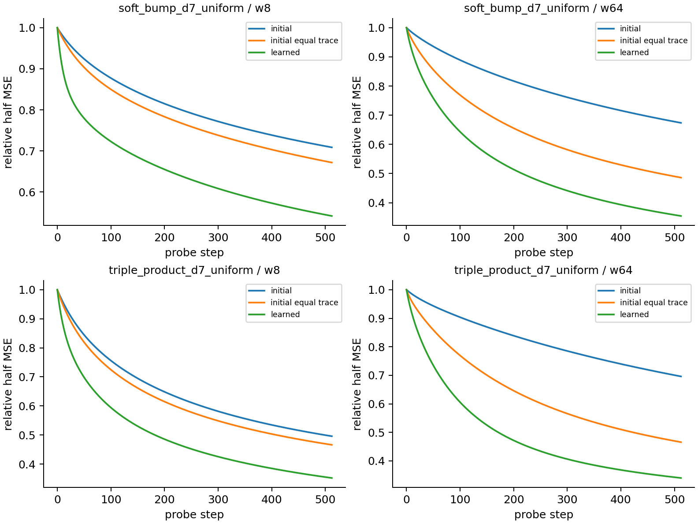

# 特征学习改变了方向，不能只兑换成更长时间

把学到的核与初始核调到相同trace、从完全相同残差开始，学到的核仍更快拟合。封存的新函数、d7、uniform分布及width64条件里，续训残余loss额外下降.114–.132；目标残差比随机置换残差获得更多曲率增益。这支持目标相关方向改变，排除了“仅把初始核整体放大”的解释。

## 区分实验

承接B02初始谱失败，本轮使用新data-seed、只预训练128步SGDplain η=.05，不重跑其成功512步cell。记录初始J₀及训练后J₁，K=JJᵀ/n；把初始核乘a=trace(K₁)/trace(K₀)。三个线性probe都从相同f₁−y残差启动：原K₀、aK₀、K₁。共同probe步长=.5/三核最大λ，稳定且没有probe间步长混杂。

如果只改全局速度，aK₀和K₁轨迹应相同。若改了目标相关方向，Rayleigh R(r,K)=rᵀKr/(rᵀr) 对真实残差的增益应超过同幅度随机置换残差。使用32置换作为诊断null，不当成32个函数。开发product/mixed_sine d3、width8/32；封存triple_product/soft_bump d7、uniform、width8/64。每unit3初始化seeds。

## 预测检验

开发4units全部支持equal-trace外的续训增益（.143–.273）。OOD训练前封存每unit三个定向预测：续训gain>.05、目标Rayleighratio>1、真实/置换meanratio>1；4units×3checks全部通过。这12checks彼此相关，证据是4个新function/widthunits，不是12个独立研究任务。

|封存OOD unit|续训gain/初始残余loss，均值±SE|目标Rayleighratio|真实/置换ratio|
|---|---:|---:|---:|
|triple_product，width8|.114±.026|2.91|1.45|
|triple_product，width64|.126±.015|1.82|1.21|
|soft_bump，width8|.130±.067|4.73|1.80|
|soft_bump，width64|.132±.010|1.97|1.32|

## 原理、边界与下一实验

对瞬时固定核SGD，初始损失下降由ηR(r,K)决定；trace只描述总尺度，漏掉目标对齐和慢模态。本实验在固定残差下交换核，明确显示训练改变了目标相关的谱形状/方向。所以有效U至少要带目标相关谱，而参数量、lr×T、trace重标度不足以决定容量比较。

Rayleigh只预测局部速度，不保证长期曲线重合或test更好；B02已有train获益而test更差的反例。本轮probe是固定晚期核的受控干预，没有声称它就是原非线性续训。soft_bump width8三seedSE较大，均值定向检验通过，不能声称每seed稳健。尚未预测泛化收益、最小充分U、Adam全程或深层LN网络。

下一轮保留可测λ、目标对齐和核形状，研究残差相位是否允许用少量量预测饱和；若重新拟合理论，另封存新条件。完整谱的精确部分属已知优化理论，当前贡献是可复算的非线性/容量反例及交换核区分证据，尚不足以称统一理论。

## 复现

~~~sh
python studies/B03_kernel_direction/run.py --phase development
python studies/B03_kernel_direction/analyze.py --phase development
python studies/B03_kernel_direction/run.py --phase ood
python studies/B03_kernel_direction/analyze.py --phase ood
~~~

24个真实MLP预训练和72条解析线性probe轨迹；两阶段约7.4秒，0failed cells。preregistration.json和ood_predictions.json保存源hash与预测；NPZ含全部数据、参数、J/K、残差、三核train/test轨迹及置换读数。analysis读取数组核对SHA；equaltrace误差≤1.78e−15。线性probe不计作新的随机训练实验，不与24个MLP训练混成96次。
