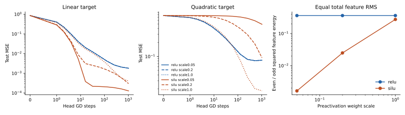

# 小尺度 SiLU 的慢通路取决于目标

在固定随机特征、统一特征均方根（RMS）、只训练线性 head 的受控实验中，小尺度 SiLU 没有统一减速：线性目标的初始进度是 ReLU 的 1.22–1.29 倍，二次目标仅为 0.63–1.10%。这支持目标相关的特征通路解释，反驳仅凭平均导数做整体时间换算。暂未验证可学习 hidden、多层网络或原 benchmark 的泛化。

## 为什么预期这种差别

对称输入、零 hidden bias 下，SiLU 的奇函数部分严格为 z/2，偶函数部分为 z·tanh(z/2)/2≈z²/4；ReLU 的两部分为 z/2、|z|/2。若预激活 z 乘小正数 a，ReLU 归一化后保留全部特征形状；SiLU 的偶部分相比奇部分多一个 a。因此二次目标相关的特征能量约多一个 a²，而线性目标不受同样抑制。

固定特征 Φ、训练 MSE L=‖Φw−y‖²/n、梯度下降步长 η 下，训练残差满足 r[t+1]=(I−2ηK)r[t]，K=ΦΦᵀ/n。初始目标核能量 A=yᵀKy/yᵀy 给出首阶进度；完整核谱与目标投影决定曲线。它不是参数位移，也不是对所有目标都等价的 U。

## 测量与预测检验

同一四维 Gaussian 对称样本，train128/test1024；目标 x₀ 和 x₀²按训练均值/方差统一。宽64、零 bias、六个配对特征 seeds；scale=.05/.2/1，ReLU/SiLU，none/preactivation-LN/linear-skip。特征先减训练均值，再统一总 RMS；head 从零起步，full-batch GD η=.8、1024 steps。216 次真实训练全保留，有限结果216/216；两个函数/recipes是研究单位，六 seeds 仅表示条件内重复。

| 事前预测 | 实际证据 | 判定 |
|---|---|---|
| ReLU 归一化曲线随正尺度不变；LN容差1e−4 | 无LN/linear-skip最大误差2.22e−16；LN误差.01585 | LN子条件失败 |
| 小SiLU偶/奇能量比随a²增长 | a=.05→.2时六seed增长14.84–15.37倍；预期16倍 | 支持 |
| 小SiLU二次通路<.1×ReLU，线性通路≥.5× | 核能量比二次.00617–.01090，线性1.350–1.374 | 支持 |
| LN基本消除尺度差，线性skip不能修复二次通路 | LN初始核能量最大相对差.602%；skip二次能量为原来.5003–.5005倍 | 支持 |
| 固定核谱预测实际训练曲线误差<1e−8 | 全部曲线最大误差4.21e−14 | 支持；也是执行核验 |

无LN时二次目标最终 test MSE 的中位数：ReLU各尺度均.08005；SiLU scale.05/.2/1分别.47971/.05684/.01766。线性目标 SiLU分别.000106/.000324/.000299，ReLU.001528。相同平均导数或总 RMS 没有描述这种目标差异。

LN把预激活归一化，却同时改变输入的径向信息；二次目标 test MSE约.47–.52。尺度不变不等于目标适配，不能从该实验推出LN普遍修复性能。有限epsilon在小尺度下破坏精确齐次性，初始能量仍近似不变但长期曲线积累出差距；失败预测按原阈值保留。

## 可以使用的知识与边界

小激活不能独立决定激活函数排序。对称零bias、固定特征下，应同时看目标的奇偶结构与目标相关核能量：线性目标不支持“ReLU学习更快”；偶目标可以因SiLU偶通路的a²抑制而显著变慢。线性skip增加奇通路而不能直接恢复偶通路。

下一轮会干预奇偶能量而不是提高统一学习率；在未见维度、分布、尺度和交互目标上提前封存预测。C01是development测量，未测solver收益、噪声过拟合或可学习hidden。它只为K1056提供一个局部候选机制，不把旧胜率重新解释为已证实因果。

## 复现与恢复

在prototype根目录运行 python studies/C01_activation_scale/run_study.py，再运行同目录 analyze.py。source_manifest.json pin执行源码、事前配置与data.npz的数组/文件hash；逐cell JSON/NPZ保存全部结果。recovery_audit.json记录首cell后停止、再运行复用1cell/新训练215cell，首cell内容hash与mtime均未改变。实际训练总6.79秒，完整第二次调用7.10秒。
