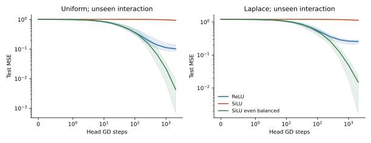

# 只恢复偶通路，小尺度 SiLU 的交互目标学习恢复

C01 的解释通过了一次封存条件后的外推检验。在未见八维 Uniform/Laplace 数据、宽128、交互目标 x₀x₁、scale=.03 下，仅用训练输入匹配奇偶特征能量，小尺度 SiLU 的2048-step test MSE分别从 .9526→.00428、1.1365→.01499。每个分布四个配对 seeds 全部改善，ReLU 对照为 .1033/.2589。该结果是固定特征上的机理干预与 OOD 证据，还不是可学习hidden、原benchmark或sol涨分证据。

## 封存了什么，实际测了什么

在第一次 OOD 数据生成前，preregistration.json 已固定 C01 报告hash、所有条件和O1–O5预测，执行器随后保留源码副本。开发域是四维Gaussian、宽64、x₀/x₀²、scales=.05/.2/1。新域为八维、宽128、Uniform/Laplace、x₀+.5x₁/x₀x₁、scales=.03/.1/.4；train256/test2048，两个分布独立数据seeds，每个recipe四个配对特征seeds。变化涉及结构、分布和函数，不把换seed叫做OOD。

固定零bias hidden特征，head零初始化，full-batch GD η=.8、2048steps、统一总RMS。干预仅把已中心化的偶通路乘系数g，使其偶/奇平方能量等于同输入/同权重的ReLU参考；不使用标签。SiLU奇通路严格为z/2，所以干预保留奇通路形状，再经统一RMS归一。所有192训练均有限并保留；总训练15.32秒，进程15.97秒。

## 事前预测与结果

| 预测 | 原判据 | 结果 |
|---|---|---|
| O1：small-SiLU弱交互/强线性通路跨域成立 | 交互能量<.1×ReLU；线性>.5×；全部seed | 交互.00165–.00369×；线性1.334–1.407× |
| O2：无标签偶通路匹配恢复初始进度 | ≥20×plain-SiLU且≥.5×ReLU | 恢复416.7–587.9倍；为ReLU .970–1.537倍 |
| O3：2048-step未见交互test改善 | 每分布≥3/4seed且均值改善 | 两分布均4/4；MSE差−.9483/−1.1215 |
| O4：匹配后.03/.1通路近似重合 | 线性能量误差<1e−8，交互<10% | 线性≤4.44e−16；交互≤.953% |
| O5：固定核谱预测训练曲线 | 全192cells最大loss误差<1e−8 | 6.72e−14 |

| 分布/交互目标 | ReLU .03 test MSE均值 | SiLU .03原版 | SiLU .03偶通路匹配 |
|---|---|---|---|
| Uniform | .10331 | .95260 | .00428 |
| Laplace | .25894 | 1.13648 | .01499 |

恢复并非只把SiLU变成ReLU：相同奇偶能量不要求偶特征形状相同。小尺度SiLU的偶通路近似二次型，对交互目标比|z|通路更适配；这解释了匹配后低于ReLU的误差，但仍是两个目标/分布条件下的证据，不是普遍优势。

## 解释边界与下一实验

总RMS一样仍可有数百倍的目标核能量差；平均导数或单一“有效学习时间”无法替代目标投影。具体动力学仍由K及其目标谱决定，C01/C02完整训练残差与谱预测重合是这个局部解释的独立数值核验。

线性目标plain-SiLU在.03下test MSE .000040/.000059；偶通路匹配后 .000265/.000844，仍很小但确有代价。没有一种目标无关的最佳激活排序。非对称数据、非零bias、可学习hidden与多层网络可打破严格奇偶分离；C03应实际检验这些边界。

这次OOD结果从观察后即进入development；再修改理论须封存新条件。当前未测噪声过拟合、分类置信度、强模型收益，也不把C01/02216+192训练算成408个独立实例。研究单位是目标/分布recipe，seeds是条件内稳健性。

## 复现

在prototype根目录运行 python studies/C02_parity_ood/run_study.py；随后运行 studies/C02_parity_ood/analyze.py。必须保留C01/executed/run_study.py与原report.md的hash。source_manifest.json pin源码与数据数组，results/保存每cellJSON/NPZ，summary.json保留原预测和配对差值，不选择test最优点。
