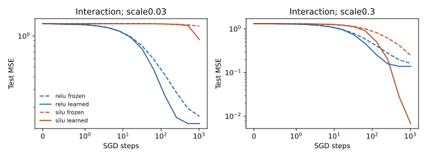

# Hidden学习能部分逃出瓶颈，不能直接套固定核时间

把C01/C02的hidden冻结限制放开后，SiLU小尺度交互通路仍慢，但特征能量会主动增长。在对称Gaussian、scale=.03下，SiLU最终train MSE从冻结hidden的 .9264降到学习hidden的 .6234，test从1.2522降到 .9247；四seeds全部改善，仍明显差于ReLU learned的 .1392。scale=.3时SiLU learned test .00681反而优于ReLU .1392。小尺度与目标条件改变了排序，不能写成激活函数统一优劣。

## 受控变化

四维Gaussian数据train128/test1024；另将输入每维平移.7，观察对称性失效边界。目标x₀和x₀x₁按train均值/RMS处理；宽64、零hidden bias、head零初始化。固定scale=.03/.3，ReLU/SiLU，hidden frozen/learned，四配对seeds，共128次全有限真实SGD，full-batch lr=.3、1024steps、无momentum/decay。

为了区分通路形状与参数尺度，训练参数W初始N(0,1)，z=scale·xWᵀ/√d，scale固定。初始训练特征均值/RMS冻结为常量；hidden学习可改变之后的实际RMS。此参数化不是原benchmark的default初始化，不把结论外推到所有优化器或多层模型。

## 事前预测检验

| 预测 | 实际结果 |
|---|---|
| H1：step1小SiLU交互弱而线性不弱，frozen/learned均如此 | 交互进度比ReLU .00231–.00292，线性1.348–1.357；支持 |
| H2：hidden学习改善小SiLU，但step128仍慢于ReLU | 最终train改善 .1200–.4808；step128 MSE高于ReLU .893–.928；支持 |
| H3：固定初始核谱只精确预测frozen曲线 | frozen误差≤7.18e−14，learned最大误差 .48084；支持 |
| H4：逃出伴随偶能量或目标核能量增长 | 小SiLU偶能量增长2.19–8.07倍，目标核能量增长6.06–28.09倍；支持，非中介证明 |

head零初始化使第一步hidden梯度严格为零，H1的初始比较等于线性head通路比较，不能作为hidden因果证据。后续真实参数更新、非零hidden位移、能量增长与frozen干预才构成learned-hidden证据。

| 对称交互目标 | ReLU frozen/learned test | SiLU frozen/learned test |
|---|---|---|
| scale=.03 | .16363/.13924 | 1.25224/.92472 |
| scale=.3 | .16363/.13924 | .24932/.00681 |

## 哪里不能外推

非对称平移输入使交互目标带有可用线性部分；.03 SiLU frozen test降为 .4106，learned .3908。它仍输ReLU .1012，但差距与对称目标不同。该边界是development结果，未宣称新的OOD成功。

初始核谱在learned hidden后失准符合假设变化；新理论需测随时间变化的特征/目标谱或局部Jacobian，不应把初始核参量称作全程万能U。C03仅一层hidden，没有噪声、classification或solver评测。训练11.88秒；source_manifest.json及逐cellJSON/NPZ保存全部执行/data/result hash；运行run_study.py可复用已保存训练，analyze.py重新计算判据与图。
