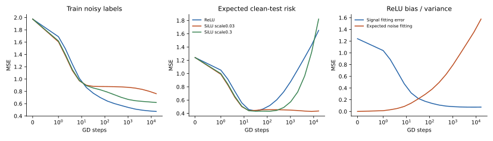

# U型风险来自信号与噪声的不同学习时间

在冻结特征、稳定梯度下降的小样本噪声回归中，train MSE持续下降，clean-test风险先降后升。n32、噪声标准差1的ReLU条件，期望clean-test风险在step32最低，四seeds均发生后期上升；均值 .4363→1.6507，而最终训练MSE .4737。相同lr和预算下，小尺度SiLU最终风险 .4359，却保留 .1832信号拟合误差。缓慢通路同时推迟信号和噪声，不能只根据train进度选赢家。

## 定义和可检验解释

固定Φ和零初始化head时，预测对训练标签线性。分别训练clean标签与同一噪声ε，就有 f_total=f_signal+f_noise。clean-test风险逐点分解为 signal bias + realized noise energy + cross term。对独立零均值训练噪声取条件期望后，cross term消失，得到 bias²(t)+variance(t)。

令训练核K=ΦΦᵀ/n=VΛVᵀ、q_j=1−2ηλ_j，test basis B=Φ_testΦᵀV/n。噪声标准差σ时，条件噪声方差为 σ²Σ_j mean(B_j²)[(1−q_jᵗ)/λ_j]²；λ=0取极限2ηt。本实验谱稳定且q非负，噪声方差随时间增加，信号bias可能减少；最优时间取决于两者及test投影，不是η×steps的固定阈值。该公式是固定线性特征的经典bias/variance结构，本实验验证它的具体适用与激活条件，不宣称发明普遍理论。

## 受控实验与预测

四维对称Gaussian，目标x₀+.5x₀x₁，train32/128、test2048、噪声σ=0/1；宽128零bias冻结hidden，ReLU/SiLU、scale=.03/.3。统一初始特征总RMS，head含bias，full-batch GD η=.3、16384steps。四配对data/feature seeds，每次同时实际训练total/signal/noise三个heads；64recipes全部有限保留，训练14.07秒。

| 事前预测 | 实际结果 |
|---|---|
| N1：train单调下降但n32噪声ReLU期望test后期上升≥.05 | 全64train曲线单调；四seeds后期升 .656–1.784；支持 |
| N2：late noise增长超过signal改善；风险恒等式误差<1e−8 | 噪声增 .781–1.971，bias降 .088–.193；分解最大误差3.33e−15；支持 |
| N3：n128减少ReLU最终期望风险 | 1.6507→.4264；支持该recipe，非普遍sample-law |
| N4：small-SiLU最优时间推迟且final噪声variance更低 | 最优steps16/8192/16384/16384，ReLU均32；variance .2527 vs1.5767；中位数支持，单seed不一致 |

| 噪声σ=1 | 均值最小期望风险 | 最终期望风险 | 最终实际clean-test风险 |
|---|---|---|---|
| n32 ReLU | .4363 | 1.6507 | .9675 |
| n32 SiLU .03 | .4177 | .4359 | .3436 |
| n32 SiLU .3 | .4214 | 1.8213 | .8158 |
| n128 ReLU | .1467 | .4264 | .4546 |
| n128 SiLU .03 | .1661 | .1661 | .1657 |
| n128 SiLU .3 | .1258 | .1714 | .1623 |

期望值是给定特征/输入、对训练噪声取平均的理论读数；实际每recipe只有一个噪声draw，四draw均值可偏離期望，所以同时展示。最小值事后描述曲线，不作为提前停止效果；test数据未用于改lr或选KB。

## 不能从这里推断什么

无噪声ReLU部分条件也有小幅late test上升，说明模型拟合偏好与有限样本插值本身仍可增加bias；噪声不是所有U型现象的唯一解释。分类CE的置信度、可学习hidden、Adam、深层模型均未检验，不能用此模型解释K1197全部现象。

下一轮会封存六维Uniform、n64、不同目标/噪声/width，在任何训练前用初始核预测完整期望风险与转坏时间，再比较实际训练和多噪声样本。新科学检验与sol涨分单独报告。

运行run_study.py可恢复且不重跑保存recipes；analyze.py重新核验数组hash、原判据和曲线。source_manifest.json保存执行源码和datahash，逐cellJSON/NPZ保存实际训练与noise分解。
