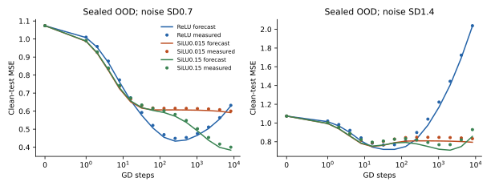

# 未见条件的完整风险曲线在训练前预测成功

用C04固定特征模型，对未见六维Uniform、宽96、train64、新目标sin(x₀)+.7x₀x₁+.2x₂²、噪声σ=.7/1.4、scale=.015/.15保存整条风险预测，再单独执行真实GD。24recipes各16个噪声draw的MonteCarlo均值与预测在全部48个预定检查点相差≤3SE；24个风险最小时间中17个精确命中，其余相差一倍。这是新条件上的前瞻风险预测，范围仍是冻结特征线性head。

## 预测封存与执行

第一阶段forecast只生成数据/初始特征，解析计算clean训练误差、clean-test信号误差、噪声方差与期望风险；不执行训练。每recipe的全部预测保存于forecasts/，forecast_seal.json冻结其hash、C04报告、执行器与数据，明确observed_training_results=0。第二阶段train逐recipe核验同一contract与封存预测后再执行8192步GD。两阶段是独立进程。

三个配对data/feature seeds，每个recipe16个独立训练噪声draw，同时实际训练一个clean head与16个noisy heads。24recipes合计408个head轨迹，不能算408个独立目标。Ση=2048相同，预测差异由初始特征谱、目标投影、test映射与噪声定义产生。全部结果有限保存，训练3.11秒。

## 原预测检验

| 事前预测 | 结果 |
|---|---|
| R1：clean-signal实际train/test曲线与谱预测误差<1e−8 | 最大8.55e−14；支持 |
| R2：final及预测beststep的MonteCarlo风险≥90%在预测±3SE | 48/48；支持，SE只测16噪声draw |
| R3：train单调，风险最小时间中位误差≤2个log₂step | 全训练单调；中位误差0，17/24精确、24/24在factor2内 |
| R4：提高噪声最优时间不更晚；小SiLU噪声variance低于ReLU | 12/12条件不更晚，6/6variance比较成立 |

三个seeds中，σ=.7的ReLU最佳预测steps512/256/256；σ=1.4变为32/32/64。Small-SiLU .015在σ=.7仍持续到8192，σ=1.4的最小值提前到16。增加噪声不仅改变最终误差，还可让小尺度通路从“后续继续学有收益”变成“只取早期线性收益”。不能使用统一epoch或U阈值判断充分拟合/过拟合。

## 证据能支持到哪里

固定谱公式不是从这24训练结果拟合出来的；理论是固定特征MSE的线性动力学与条件bias/variance。C05验证其跨新函数、维度、输入分布、容量及噪声条件的定量预测能力。预测允许查看封存的新数据和clean函数值，属于已知任务、未见训练结局的科学预测；不是隐藏函数盲预测，也不是无需数据的通用经验公式。

风险最小时间是预先保存的谱预测与事后测量比较；没有用test结果挑选超参数或KB。16噪声draw减小MonteCarlo误差，不提供16个OOD任务。learned-hidden在C03已偏离固定谱，所以此预测不能直接套到完整MLP、Adam或分类CE。Sol收益未测。

复现顺序为run_study.py forecast，再run_study.py train，最后analyze.py；若已有封存预测或已成功训练，只核验并复用，不覆盖它们。source_manifest.json、forecast_seal.json和逐cellJSON/NPZ可独立核验。

独立复核补充：48次预定检查中有5组beststep与final同为8192，因此实际43个不同recipe×checkpoint全部通过；5个预测最优点位于预算末端。17/24精确指doubling grid检查点，不是连续步数的精确最优。公式使用clean train/test标签，不能直接用作无test-label的部署早停器。详见directions/A_residual_features/release_review.md。
