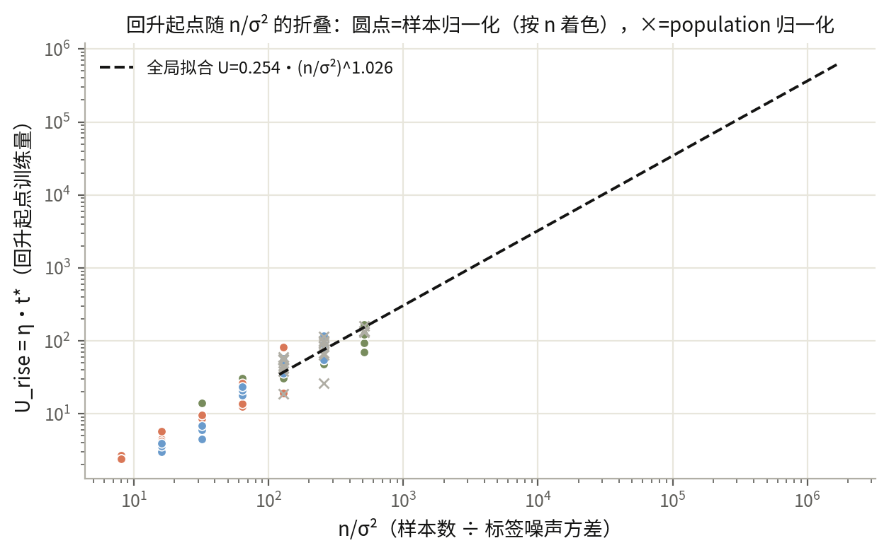

# D2 整合版：test 风险何时回升、回升后如何增长

读者面向的整合文档（协调者 2026-10-08，零训练事后分析，存档于 studies/integration_20261008/）。活文档与逐轮审计细节见 report.md 与 findings/。

## 结论

1. **精确的部分：风险分解 R(t)=B(t)+σ²·N(t) 逐点成立（79/79 条保存曲线，浮点误差 0）。** 给定一条保存的冻结特征曲线，信号项 B 与噪声形状 N 已固定；标签噪声方差 σ² 的全部作用是把 N 精确缩放。所以"改 σ² 会怎样"是恒等式推论：四次低噪声重加权复核（σ²=.125→.0625，seed411/412/413）全部零训练得到。
2. **σ² 方向精确、n 方向近似——这是 n/σ² 比例律的真实地位。** 已测格点内全局拟合 U_rise=0.254·(n/σ²)^1.026，58/60 在 2 倍内（最大 2.23）；三次留出 n 拟合给 b=1.056/0.969/1.090、C=0.215/0.328/0.203。但它不是折叠：n=32–128 不大于特征维度 128，样本谱不集中——同 seed、同 σ² 下 n·N(t) 跨 n 最大偏差 8–47%，B(t) 偏差 37–68%（t∈[64,4096]，整合分析实测）。机制拆成两句：代数上的 1/n 因子精确；"谱泛函与 n 无关"需要谱集中，在 n≲d 不成立。**对 1/σ² 的比例是恒等式级的；对 n 的比例只在谱集中时涌现**，已测区间里是 ±2 倍经验趋势。可证预言：n≫d 时折叠应变好——未测。
3. **折叠失败的来源分离成两个。** 同 n/σ²=128 配对：样本归一化下 40/44 在 2 倍内（"全部折叠"被推翻）；换 population 归一化后 4 个 seed 中 3 个收进 1.10 以内（平均 |log2 比值| 0.554→0.071），seed414 从 2.81 变 3.24 仍在。即样本归一化伪影（可移除）+ 有限 n 异常谱抽样（不可移除）。
4. **回升起点就是风险最低点。** 78/78 条曲线在内部最低点下一步即升高，到 16384 步无下降段（网格分辨 0.3 步）。
5. **上升支短段幂律：L_test(U)−L_min ≈ C·x^1.5456，x=(U−U_rise)/U_rise ∈ [0.1,1]。** 原扫描 54/60、后续条件 17/18 条曲线全部取样点 2 倍内；C 取各曲线 x=1 处实测回升量（0.00102–0.1196）。x>1 后 78/78 超 2 倍（高估 4.9–2635 倍）：短段描述，不是渐近律；要整条风险用固定特征解析递推。
6. **低噪声下 U 型可见性有 seed 依赖边界。** σ²=.0625 时操作性判据（终点−最低 ≥.05）：seed411 成立（Δ=.0821），seed412 不成立（.0222），seed413 不成立（.0142，推翻预注册区间 [.015,.045]）。三条都保留内部最低点与正回升——阈值是操作约定，不是形状消失。

![图 2：上升支折叠。78 条保存曲线归一化为 (x,(L−L_min)/C)；绿带 x∈[0.1,1] 内贴 x^1.5456，x>1 发散](figs/rising_branch_collapse.png)

## 注册定义（约定，不是发现）

操作性 U 型判据：终点−最低 ≥0.05 且最低点内部。t\*：整数网格 0..16384 期望风险第一个 argmin；U_rise=η·t\*，η=0.3。风险：无噪声审计标签条件期望 MSE；归一化变体逐条声明。折叠判据：配对 t\* 比值 ∈[0.5,2]；预测判据：2 倍内。

## Formulation

已知解析式（背景理论）：K=ΦΦᵀ/n=V diag(λ_j)Vᵀ；q_j=1−2ηλ_j；f_j(t)=(1−q_jᵗ)/λ_j（λ_j=0 时 2ηt）；A_t=ΦᵀV diag(f_j(t))VᵀΦ/n；R(t)=‖Φ_aA_ty−y_a‖²/m+σ²‖Φ_aA_t‖_F²/m ≡ B(t)+σ²N(t)。符号：n、m=2048 行；Φ 含 bias 列；λ_j 为训练 Gram 特征值；σ² 为归一化标签单位噪声方差；R、B、N 单位标签平方；t 单位步。A_t 含 1/n ⇒ N 的 1/n 因子精确；谱泛函的 n 集中性是经验问题（实测 n≤128 不集中）。
经验式（development）：log t\*=a+b·log(n/σ²)，留出 (a,b)=(−.33541,1.05557)/(.09033,.96928)/(−.39273,1.09019)，全局 (−1.37013,1.02622)；上升支 L−L_min=C·x^p，p=1.5455654305138984。

## 成立程度

| 主张 | 判据与通过率 | 备注 |
|---|---|---|
| 恒等式 R=B+σ²N | 79/79，误差 0.0 | 浮点精确 |
| 全局幂律 | 58/60 在 2 倍内 | max 2.23，格点内 |
| 留出 n 预测 | 57/60（判据 ≥48/60） | 失败 2.286/2.099/2.571 倍 |
| 严格折叠 | 40/44，被推翻 | 反例 3 组保留 |
| population 去伪影 | 3/4 seed 收进 1.10 | seed414 保留 3.24 |
| 起点=最低点 | 78/78 | 单调至窗口末 |
| 短段幂律 | 54/60+17/18 全点 2 倍内 | 逐曲线指数 0.920–1.886 |
| 尾部外推 | 78/78 失败 | 4.9–2635 倍，自驳保留 |
| 低噪声可见性 | 支持/支持/推翻 | seed411/412/413 |
| 跨 n 集中度 | 不集中（devN 8–47%、devB 37–68%） | 机制的限定条件 |

**不要外推到**：学到特征、非线性读出、交叉熵、小批量、Adam、其他目标/维度、n≫d 谱集中区。所有结果 development；t\* 与 C 依赖干净标签，非 train-only 早停信号。

## 方法与条件

冻结 ReLU width=128、scale=0.03；4 维对称高斯输入（antithetic）；目标 x₀+0.5·x₀x₁；线性头零初始化含 bias；float64；全批量 GD η=0.3、无动量无衰减、16384 步；审计 2048 行；seeds 411–414。序列：r003 扫描（60 cell）→ r019 归一化对照 → r051 噪声减半（r039 作废）→ r083/r095/r112 低噪声重加权 → rewrite_20261007 上升支事后拟合 → integration_20261008 整合分析。cell=条件×seed；配对不作独立条件。

## 失败与反例

严格折叠 refuted（40/44；seed414 64/180/176 步、seed412 390/160、seed413 20/47）；r095 区间 refuted（.014188114）；尾部外推 78/78 自驳；r039 沙箱违规作废（0 数字）；逐曲线指数散 0.920–1.886（共同指数仅短段公共描述）。

## 未决问题

n≫d 折叠恢复与系数收敛；C 的谱表达式（对照 0.20–0.33）；train-only 早停；seed414 反例的抽样/投影/谱三分归因。

## 证据

studies/r003、r019、r051、r083、r095、r112、rewrite_20261007、integration_20261008 的 summary.json 与 results/*.npz；findings/ 逐轮 .md；整合分析脚本与 summary、两张图源码在 studies/integration_20261008/。report.md 为活文档（r112 收尾中，含外推收回 commit c45576b）。
