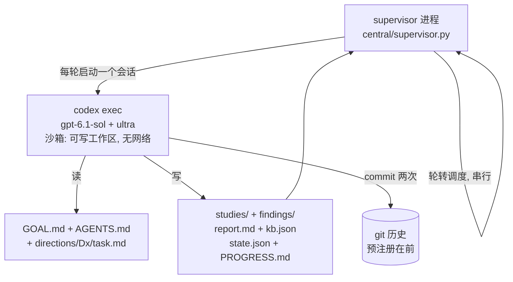

# 启动报告 — science_program_v2 中心化自动研究 · 2026-10-06

🤖 gpt-6.1-sol（Sol 6.1 Ultra） · 🧠 effort=ultra · 🔁 本地 relay 3107（cctq 主路由，phybench 兜底） · ⏱️ 轮超时 7200 秒 · 📊 预算 3 轮 × 8 方向 = 24 轮 · 🖥️ 本机 CPU 小张量 · 📁 `aiq_rl/experiments/science_program_v2` · 📅 启动 2026-10-06 16:58（北京时间）

## 1. 结论

程序已启动。supervisor 进程 PID 58101 在跑。第 1 轮（方向 D1）于 16:58:09 开始，会话正常调用模型。基线 commit 是 `e9b7a24`。

## 2. 你之前的 goal 没有找到

我在本机搜索了你说的 goal 文件。文件不存在。旧交接记录也写明：守候机制没有收到过真实指令。你的 4 个例子这次直接写进了 `GOAL.md`。它们是 D1、D2、D3、D4。

## 3. 系统结构

一个 supervisor 进程管理全部研究。supervisor 每次启动一个 codex 会话。会话做完一轮就退出。记忆存在文件和 git 里，不存在会话里。这就是中心化：单进程、单状态、单 KB、单 git 历史。



## 4. 八个方向

前 4 个来自你的例子。后 4 个来自 v1 留下的未决问题。

| ID | 问题（平实语言） | 来源 |
|---|---|---|
| D1 | "等效训练时间 U" 什么时候可信。重点查你点名的现象：动量为 0 时 U 异常变小 | 你的例子；主线 K1019 记录了 10 倍差 |
| D2 | 过拟合的 U 型曲线。最低点在哪。能不能不看测试标签就早停 | 你的例子；v1 C04/C05 |
| D3 | 用什么可测的量描述模型容量和分辨率 | 你的例子；v1 B 方向 |
| D4 | 训练曲线能不能用 sigmoid 描述。sigmoid 参数有没有公式 | 你的新想法；v1 B01 有精确解析基线 |
| D5 | LN 在同宽度下为什么有效。v1 没证明机制 | v1 A03/A04 未决 |
| D6 | 特征学习让核漂移。能不能用早期测量预测晚期 | v1 B02/B03 未决 |
| D7 | 什么时候"训练更好、测试更差"。v1 测到 8/8 与 6/8 的分裂 | v1 B02 未决 |
| D8 | 激活通路结论在有 bias、非对称、多层、分类损失下还剩多少 | v1 C01–C03 未决 |

## 5. 每轮的规矩

会话必须按固定流程走：读中心文件，选一个小问题，写预注册并 commit，跑实验，写发现，更新中心 KB 和进度，收尾 commit。预注册 commit 必须早于实验。这修复了 v1 的时序见证缺口。失败预测必须保留。计数不许夸大：recipe 是单位，seed 只测稳健性。

## 6. 安全边界

沙箱只允许写程序目录和 /tmp。会话无网络。模型调用由 codex 本体走本地 relay，不受沙箱影响。v1 repo、主线数据、网页 publisher 全部只读。不 push，不动 benchmark test，不做解题评测。supervisor 不会自我重启。

WARNING: 立即 kill supervisor 会留下半轮产物。优先用 `touch central/STOP` 温和停车。半轮产物可以人工 `git checkout -- .` 丢弃。

## 7. 你现在能做的操作

```sh
cd aiq_rl/experiments/science_program_v2
cat reports/PROGRESS.md        # 看进度
tail -5 central/log.jsonl      # 看轮次事件
git log --oneline | head       # 看研究时序
touch central/STOP             # 温和停车
kill $(cat central/supervisor.lock)   # 立即停车
echo "指令" >> directions/D1_u_effective_time/inbox.md   # 给下一轮下指令
```

预算和顺序在 `central/config.json`，每轮开始重读，改完即生效。完整细节在 `OPERATIONS.md`。

## 8. 成本

每轮是一个 ultra 会话，预计每轮数十万到百万 token。默认 24 轮封顶。本机计算每轮实验不超过 20 分钟 CPU。费用记在你自己的 cctq/phybench 账号。

## 9. 已知限制

1. 单会话上下文有限。大问题会留 partial，靠 next_question 字段接力。
2. 轮次结果依赖会话自觉输出 ROUND_RESULT 行。缺失记 unknown，人工看 output.log。
3. 没有自动质量审查。每方向 3 轮用完转 parked，等你验收再追加预算。
4. relay（3107 端口）挂掉时轮次会失败并记录，超时机制兜底，不会静默卡死。
5. 预注册时序以本机 git 时间为准，仍非外部见证。

## 10. 启动时刻的状态快照

- supervisor：PID 58101，16:58:09 启动，锁文件正常。
- 第 1 轮：方向 D1，16:58:09 开始，会话已读 task.md 并开始检查环境。
- git：基线 `e9b7a24`（20 个文件）。冻结来源 2 份，hash 已核对。
- 冒烟测试：启动前已验证 relay 链路，模型应答正常。
